import img01 from './01.jpg';

The Campus Recreation Services Brochure is a booklet to advertise all of the programs and facilities at the University of Utah for recreation services. I was involved with the photography, shoot planning and direction, editing, print layout, copy writing, and graphic design of the project. Work was done in Adobe InDesign, Photoshop, Lightroom, and Illustrator.

<Photo src={img01} alt="CRS brochure cover spread" eager />

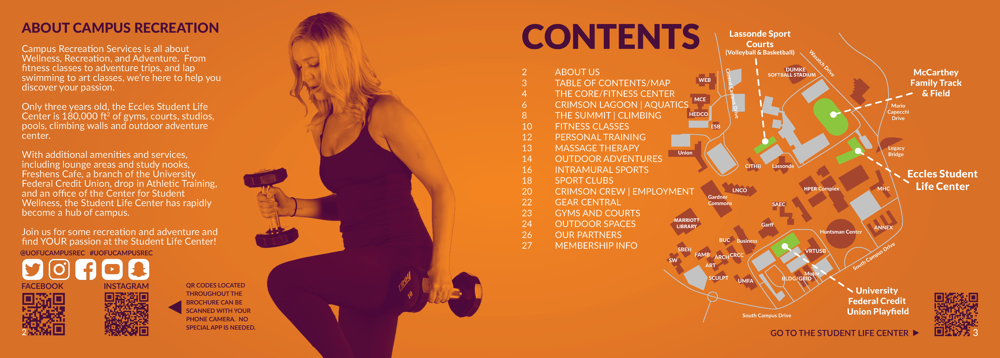

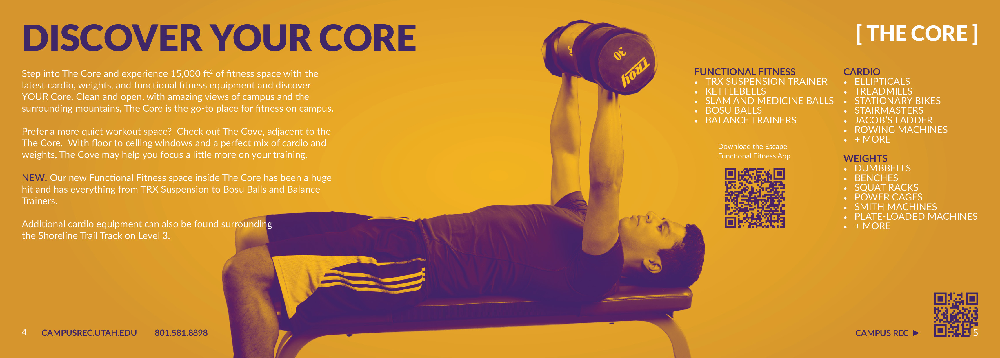

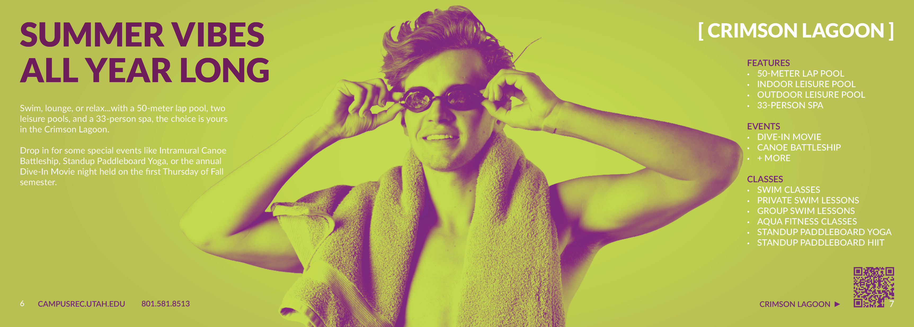

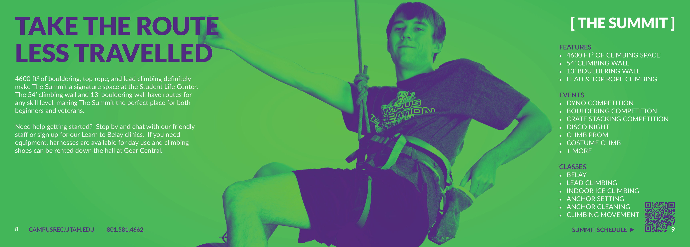

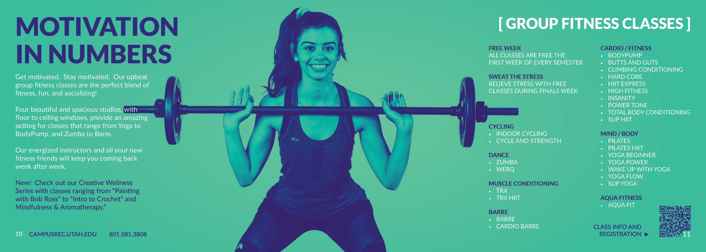

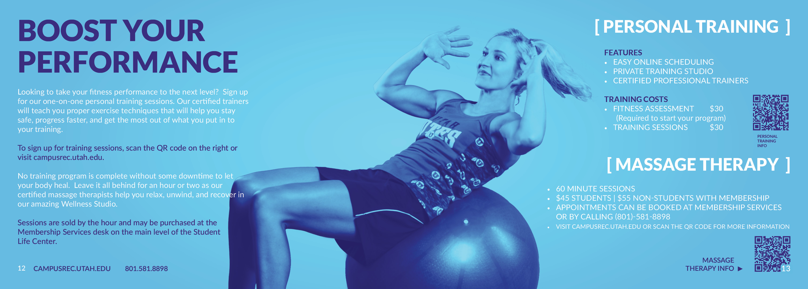

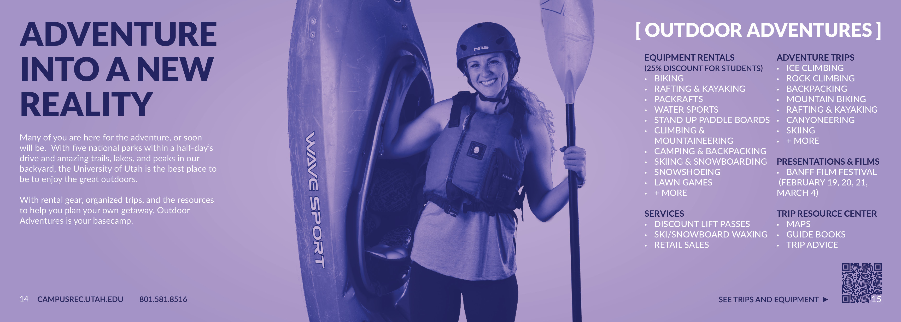

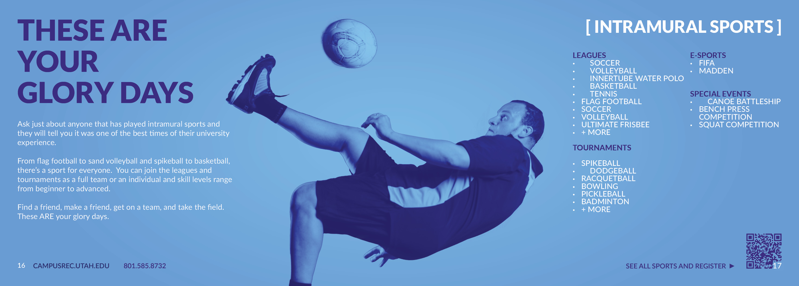

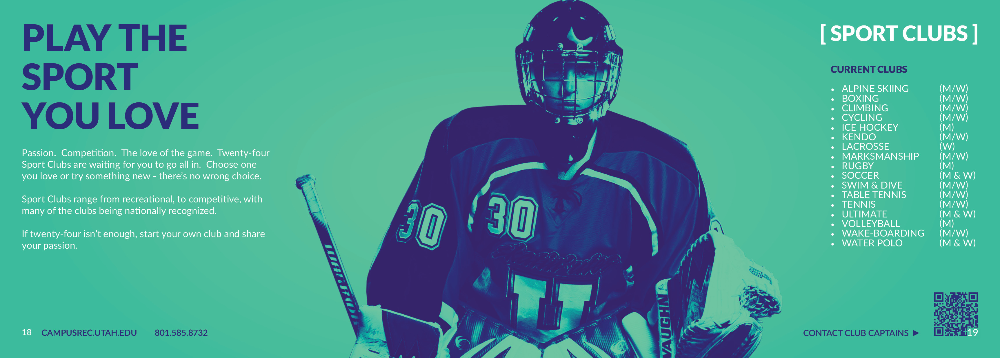

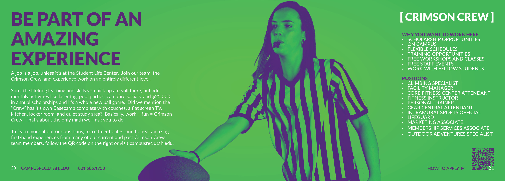

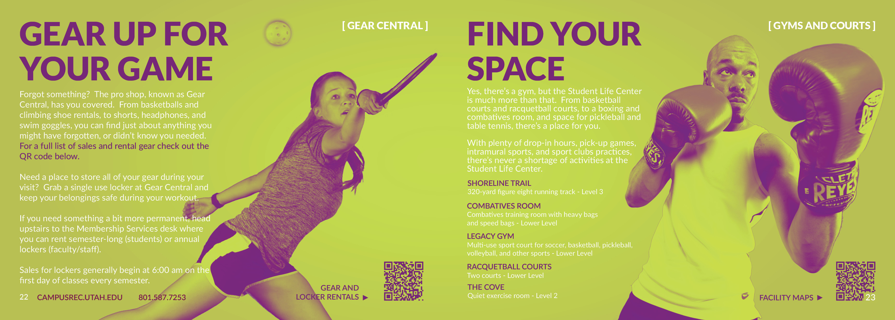

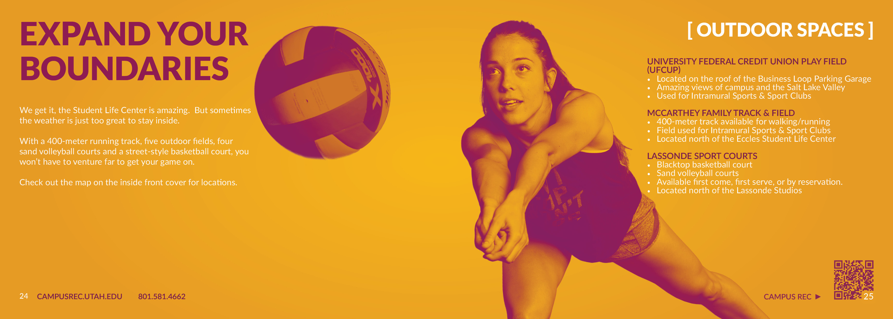

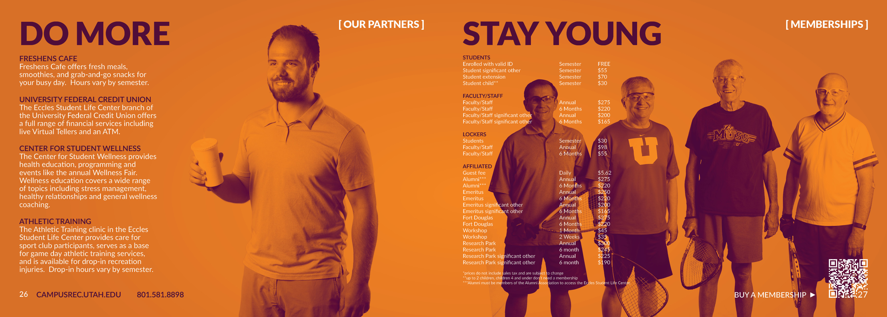

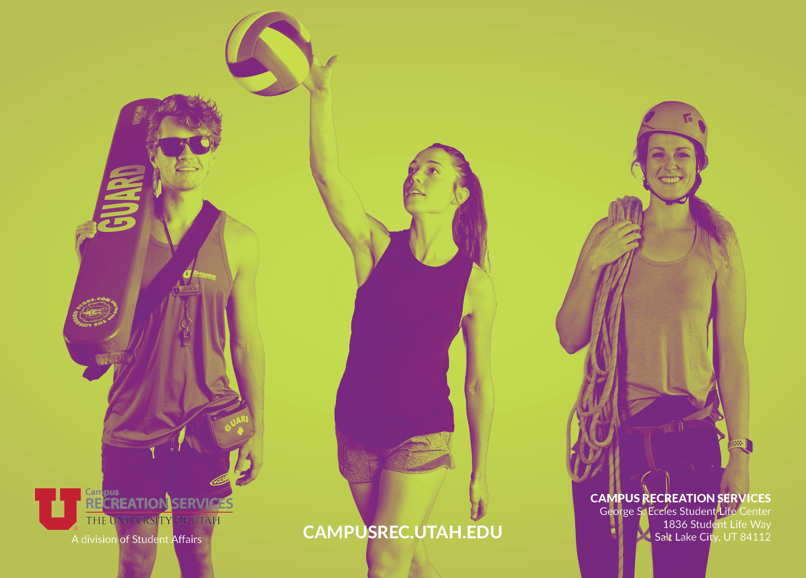
